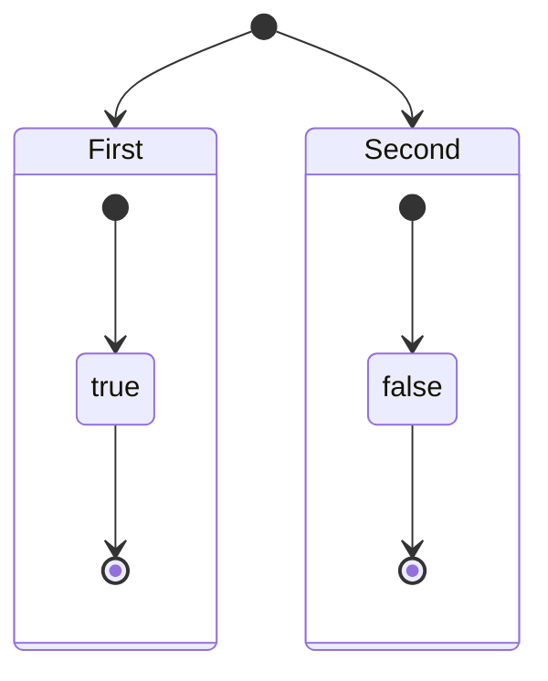
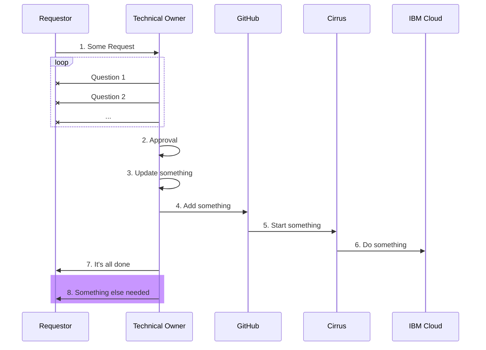
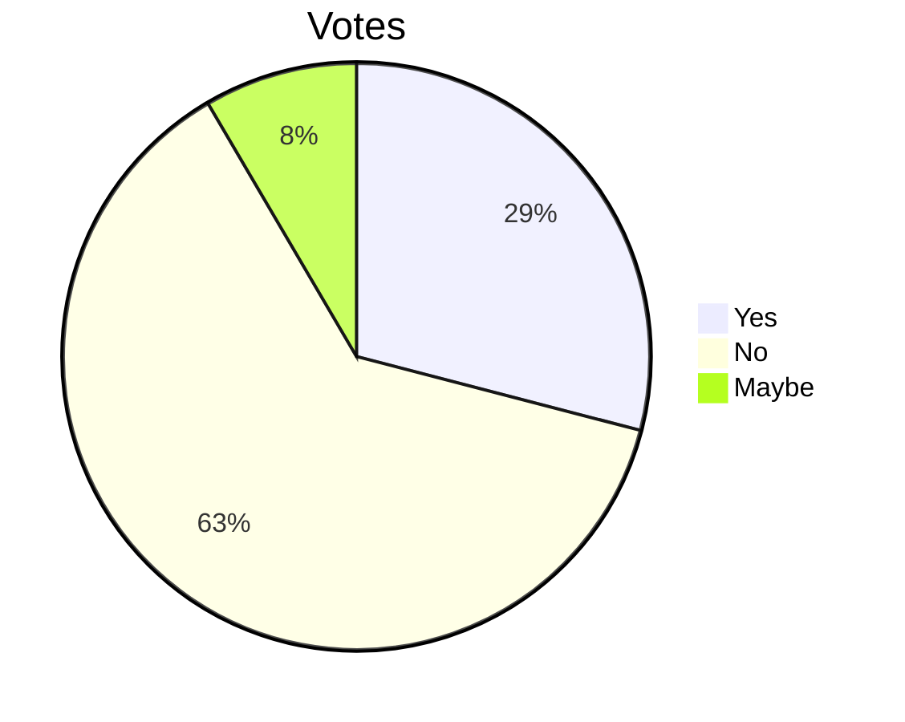
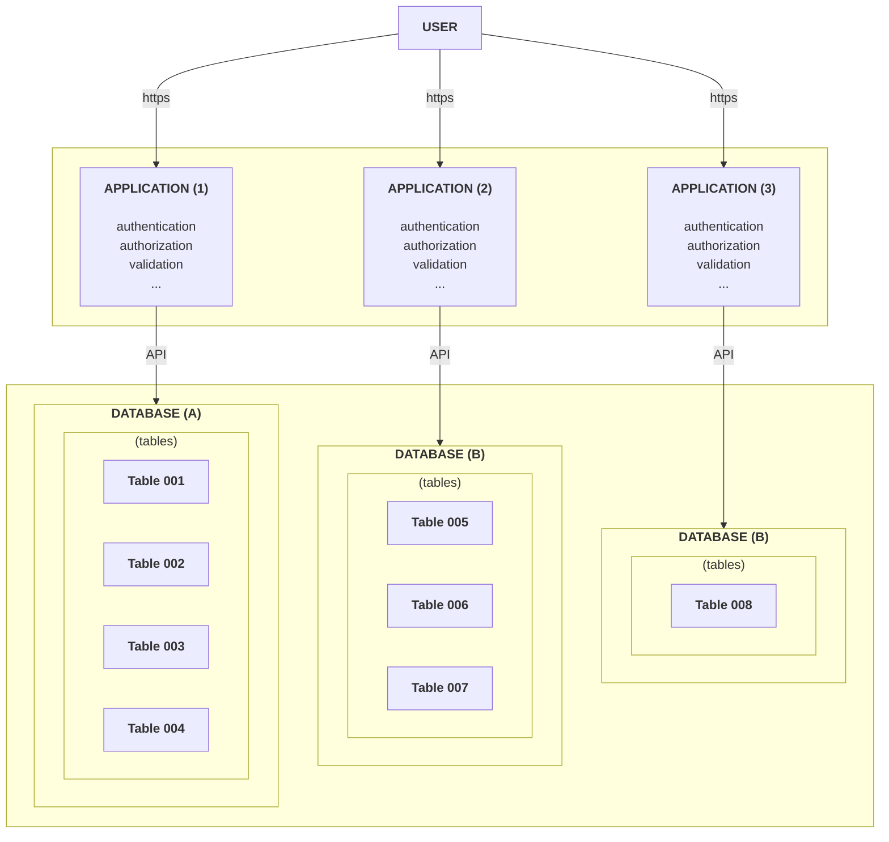
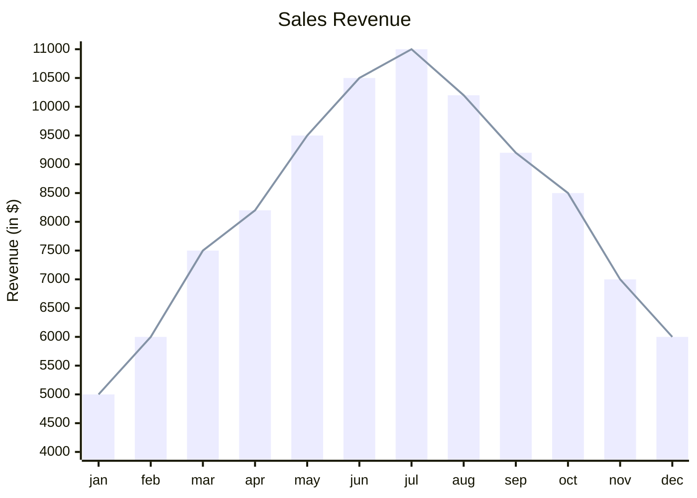
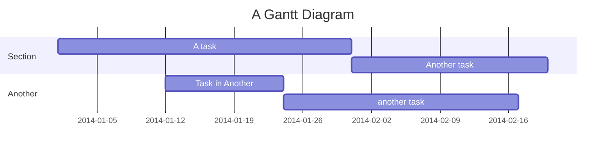
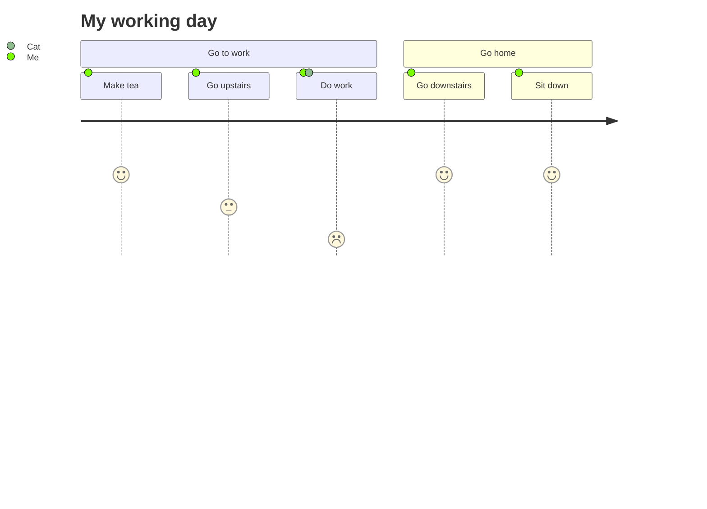

# Diagrams

This template has built-in support for powerful **[mermaid](https://mermaid.js.org/)** diagrams and charts.

The exact definitions of the below examples can be found in the `docs/examples` folder of this template.

## State Diagram

## Sequence Diagram

## Pie Chart

## Flow Chart

## XY Chart

## Gantt Chart

## User Journey

## Other

Check **[mermaid site](https://mermaid.js.org/)** for many more options.
